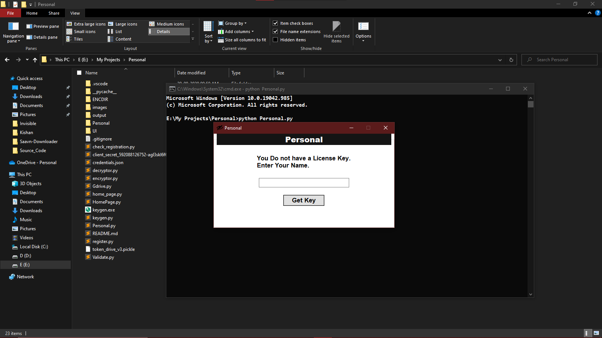
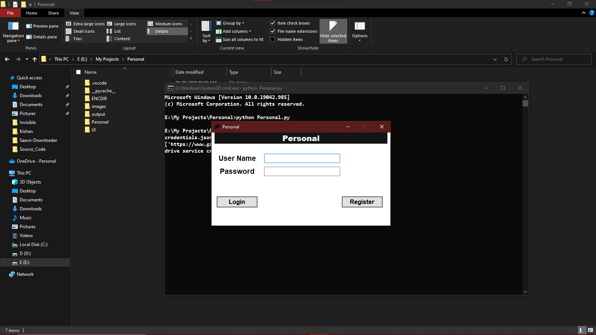
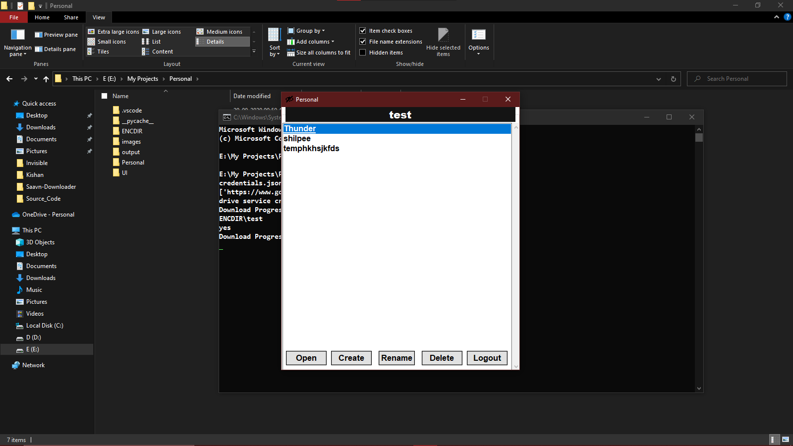
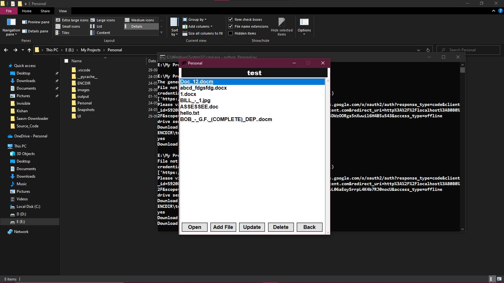

# Invisible
- It is python based GUI software that Encrypts and Hide confidential files on Google Drive which is impossible to Decrypt without password. It is second version of [Invisible](https://github.com/Mysterious-Harsh/Invisible) (hide files in local system)
## Functionality 
- Hide/Unhide multiple directory on Google Drive 
- Multiuser support by registering users ( Can't change password or delete user for now )
- After first run software also hide itself. 
## Installation 
```sh
pip install -r requirements.txt
```
- Run 
```sh 
python Personal.py
```
## Set Registration 
- Add "toaddr" and "fromaddr" and also generate app password for gmail and add it in "Validate.py" module to get key in your email
- At initial start of software, it ask for registration key which is generate by keygen.exe or keygen.py module by entering text which you received by mail.
## Set Google Drive API
- Look at this [Quickstart](https://developers.google.com/drive/api/v3/quickstart/python)
- Download credentials.json file from [google cloud console](https://console.cloud.google.com/)
- Replace it with existing credentials.json 
## Snapshots
- Initial Start

- Login

- User directories on Google Drive

- Encrypted Files on specific directory

 
